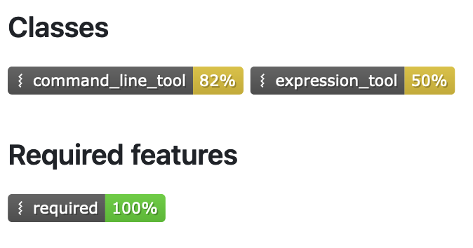

# Introduction

Workflow engines are now widely used for genome analysis workflows.
On the other hand, there are still difficulties to build and execute their workflows in various aspects.
Here are examples of such difficulties:
How to develop our workflows in workflow languages such as Common Workflow Language (CWL) [@citation:CWL], Snakemake [@citation:Snakemake], Nextflow [@citation:Nextflow], and others?
How to integrate our workflows with containers such as Docker, Singularity, and Podman?
How to integrate our workflows with job schedulers such as Slurm and GridEngine?

Our group solved these problems with the following activities. First, we cooperated with other groups to develop their workflows, and to make their workflows integrated with containers.
Second, we developed and improved workflow ecosystems to remove the barriors to develop and execute their workflows. Ecosystems include workflow executors, specifications of workflow languages, and workflow-related tools.

This paper reports what we did during the DBCLS BioHackathon 2024.

# Cooperations with other groups

- We supported people who want to install InterMine

- We supported CWL coding for [bh24-genome-variation](https://github.com/biohackathon-japan/bh24-genome-variation)
  - CWL code: [AddTogoVarAnnotation.cwl](https://github.com/ellisdoro/BioHackathonFiles2024/blob/main/Tools/AddTogoVarAnnotation.cwl)

- We shared tips about [configuration](https://snakemake.readthedocs.io/en/stable/snakefiles/configuration.html) of snakemake 8 in Manabu's blog
  - blog: https://zenn.dev/manabuishii/scraps/6df9013c36268f
 
- We shared tips about CWL in Kentaro's blog (in japanease)
  - blog: https://scrapbox.io/Open-BioInfo-yamaken/CWL

# Developments and improvements of workflow ecosystems

Here are overviews of notable reported issues, developments and improvements of ecosystems during the Hackathon.

## Report: an issue when passing array input parameters via command line arguments in cwltool

The `cwltool`, a reference runner of CWL, can take the input parameters via command line arguments in addition to a YAML or JSON file that lists the input parameters.
Here is an example of this feature.
```console
$ cat example.cwl
class: CommandLineTool
cwlVersion: v1.2

baseCommand: echo
inputs:
  inp:
    type: int
    inputBinding: {}

outputs: []
$ cwltool example.cwl --help
...
usage: example.cwl [-h] --inp INP [job_order]

positional arguments:
  job_order   Job input json file

options:
  -h, --help  show this help message and exit
  --inp INP
$ cwltool example.cwl --inp=10
...
INFO [job example.cwl] /private/tmp/docker_tmpz1a3u8k8$ echo \
    10
10
INFO [job example.cwl] completed success
{}INFO Final process status is success
```

This feature is useful especially when developing workflows.

However, it does not work for some parameter types such as `int[]` and `double[]`.
We reported this issue to the repository of `cwltool` [@citation:cwltool2034]. We also sent a pull request to fix it [@citation:cwltool2037].
Once it is merged, users can pass more complicated arguments via command line and it would help to develop their workflows.

## Development: Release a new version of shaft, an executor for CWL workflows, to demonstrate new feature of CWL conformance test suite
The CWL project provides the CWL conformance tests and the test suite for that to the developers of workflow engines.
With the conformance tests, they can check how conformant a given workflow engine is with the CWL specification.

The CWL project also provides a feature to generate badges that show how percentage of a given category was passed by a given workflow engine.
Here is an example of a conformance badge.



In this example, users can understand the following about a given workflow engine:

- it passed 82 % of tests for `CommandLineTool` including required and optional features,
- it passed 50 % of tests for `ExpressionTool` including required and optional features, and
- it passed all the tests for the required features.

This feature is very useful for users to choose appropriate workflow engines for their workflows.

On the other hand, users sometimes want to choose a specific workflow engine even if it passed less conformance tests because of its supported platforms and its nice features to control the workflows.
In such cases, they want to investigate more details of the results of the conformance tests to check whether the failed features are used in their workflows.

Before the DBCLS BioHackathon 2024, the CWL project started providing a feature that generates the detailed results of the conformance tests
in markdown files for this purpose.
Once developers of workflow engines publish the detailed results, users can investigate whether given workflow engines
can execute their workflows.
However, there were no engines that provide detailed results in markdown files yet.

To demonstrate and to encourage the developers of workflow engines for CWL to use this feature, our group releaseed a new version of `shaft` [@citation:shaft],
an executor for CWL workflows, and provides a list of detailed results of the CWL conformance tests.

Here is an example of the detailed results of the conformance tests for `CommandLineTool` category by `shaft` (Figure 2).

![Detailed result of the conformance tests for `CommandLineTool` category by `shaft` [@usesDataFrom:cltresult]](./markdown-report.png)

It consists of lists of succeeded, failed and unsupported tests by a given engine.
Each entry in a list consists of a link to the information of the test, including a description of the test and expected result, in the CWL repository, a link to the CWL tool or workflow description, and a link to the YAML or JSON file which lists input paremeters.

The CWL project already publishes a handy way to execute the conformance tests, to generate markdown reports, and upload them to the specified repository as custom GitHub Actions in the GitHub Marketplace [@citation:runtests; @citation:uploadtests]. We hope other developers will publish the markdown reports for their workflow engines.


## Other reported issues, developments and improvements during the Hackathon
Here is a brief list of other reported issues and improvements to the ecosystems.

- Update a CWL template for VSCode to use the latest syntax validator based on JSON schema
  - https://github.com/tom-tan/cwl-template-for-vscode
- Report an issue to clarify a corner case in the spec of CWL v1.3
  - https://github.com/common-workflow-language/cwl-v1.3/issues/53
- Send a pull request to clarify undocumented spec of SALAD, that is underlying spec of CWL
  - https://github.com/common-workflow-language/schema_salad/pull/861
- Update a parser generator of SALAD for Dlang to support schemas for input objects
  - https://github.com/common-workflow-language/schema_salad/pull/825
- Report an issue that potentially breaks portability between workflow engines for CWL
  - https://github.com/common-workflow-language/schema_salad/issues/863

## References

